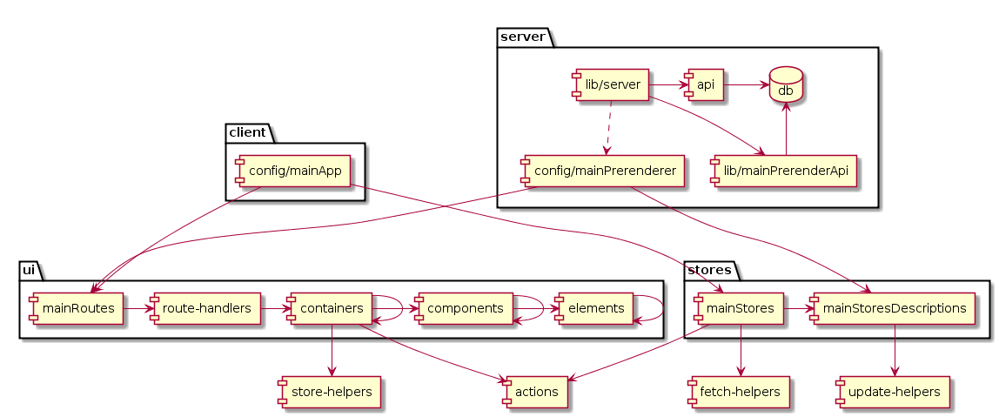

*An arrow means: `imports`*

# How Stuff Works
This documentation is for grasping the overall design. No details by intention. To get up and running quickly see `README.md`.

At first sight, it may not be immediately clear why/how certain things are called/triggered.
The below explanation points you in the right direction, so you can research further. If you want more details or documentation, see the relevant package.
Some (inconspicuously) used/relevant node modules are explicitly mentioned with package name.

## Table of contents

  * [How the app is served.](#how-the-app-is-served)
    * [development mode](#development-mode)
    * [production mode](#production-mode)
  * [How the page updates while you are programming.](#how-the-page-updates-while-you-are-programming)
    * [page reloading](#page-reloading)
    * [hot reloading](#hot-reloading)
  * [How the routes work.](#how-the-routes-work)
  * [How the server JSON API works.](#how-the-server-json-api-works)
  * [How the stores work.](#how-the-stores-work)
    * [Stores setup](#stores-setup)
    * [Stores in use](#stores-in-use)
  * [How the actions work.](#how-the-actions-work)
  * [How the server DB works.](#how-the-server-db-works)
  * [How the 'Random fail!' works.](#how-the-random-fail-works)
  * [How the build works.](#how-the-build-works)
  * [Q&A Why](#qa-why)

*****

## How the app is served.
A JS webserver is included in the form of `lib/server.js`. It can be run in two modes:

### development mode
Run the server using `npm run start-dev`.
It will use `lib/server-development.js` which will use `lib/server.js` which will use `config/simple.js` which will use `app/simple.html`. A tiny HTML file is loaded, the JS is downloaded + executed + rendered, and ultimately output is shown.

### production mode
In this mode, the React HTML output is (pre)rendered (and populated) on the server (a.k.a. isomorphic).

Run the server using `npm run start`.
It will use `lib/server-production.js` which will use `lib/server.js` which will use `config/mainPrerenderer.jsx` which will use `app/mainPrerender.html`. A big HTML file is loaded (and output is shown immediately), the JS is downloaded + executed + rendered, and output is updated.

This server side render (prerender) is possible because the React JS can be executed on the server.
In your browser the main `React.render(<Application />, document.getElementById("content"))` call (in `config/mainApp.jsx`) outputs to the browser DOM.
But when pre-rendering, the main `React.renderToString(<Application />)` call (in `app/prerender.jsx`) outputs to a string, which is inserted into the HTML (including React component states) as content.
The browser now can show the HTML instantly in the DOM, but proceeds to run the React JS that resumes the usual DOM mutations.

Note: Routes that are asynchronously loaded can not be pre-rendered.

## How the page updates while you are programming.
After running the app webserver in development mode (see above) you'd have to manually reload the page after changing a JSX file.
It is possible to automatically reload _or_ update the page to reflect your changes:

### page reloading
Ensure that you are running the app webserver in development mode.

Then run another server using `npm run dev-server`.
It will rebuild while watching for file changes, and it will trigger your page to reload afterwards.

### hot reloading
Ensure that you are running the app webserver in development mode.

Then run another server using `npm run hot-dev-server`.
It will rebuild while watching for file changes, and it will update the currently shown and affected component(s) while keeping their state.
Note this is experimental, and in some cases you'll need to refresh manually.

## How the routes work.
In React after opening the app and going to some page, there is no actual HTML loaded from the server. React app just replaces a component that acts as a page, including any child components.
But you'd like to have the URL reflect this, and allow user to use browser history (back/forward). A router takes care of these things. (package react-router)

In this case, the root of your app is not the Application React component.
This starts at `lib/server.js` which will use `config/mainApp.jsx` which instantiates the router and ultimately uses `app/mainRoutes.jsx` to load routes.
You'll find that all pages are subroutes within the `app` route, which instantiates `app/Application/index.jsx`, which contains a `<RouteHander>` component that inserts subroute output.

## How the server JSON API works.
The `lib/server.js` serves the application, but it also serves the API URLs (`lib/api.js`) that the stores talk with.
It initializes two databases (todolist and todoitem) once, and then continues to listen for GET/POST requests on specific URLs.

## How the stores work.
As in Flux; the Stores affect the React components. (package `items-store`) And the stores talk to the JSON API (`app/fetch-helpers/rest.js`).
See [Q&A Why](#qa-why)

### Stores setup
The stores are constructed as such: startpoint is `config/mainApp.jsx` which will use `app/mainStores.js`. This then:

- defines routines to handle JSON API read/writes (package `superagent`), and
- sets up a queue that only allows one REST request at a time, and aggregates subsequent changes.
  These are then sent as one request..
- and ultimately constructs the two respective `ItemStore` objects (based on `app/mainStoresDescriptions.js`) to which it assigns these routines, queue, and the initial data. This initial data may have been inserted via `app/prerender.html` and `app/`.
- These are then exported back to `config/mainApp.jsx`, along with a store named `Router`.

The store `Router` just holds a `transition` value which is later read in `app/containers/Application.jsx` to show "loading..." in UI.
The stores `TodoList` and `TodoItem` only have minor differences.

If you wonder where the default data is inserted, see (#how-the-server-db-works).

### Stores in use

todo :question: this section needs review and should be extended.

Note: Components should not access the stores except for reading in `getProps()`. Everything else should be done with actions.

## How the actions work.
The Actions affect the stores. (package items-store)

The actions are setup in `app/mainStores.js` (bottom) from `app/actions.js` which uses the implementation supplied with items-store.
They are triggered/made by the input fields in containers, such as `app/containers/TodoListPage.jsx`.
They end up affecting a store. See [How the stores work.](#how-the-stores-work)

## How the server DB works
When you run `npm run start-dev` (or without `-dev` ofcourse) this will start the server, as you can see defined in `package.json`. This lets node execute `lib/server-development.js` which uses `lib/server.js` where the default data is loaded, and a server (package express) is thrown together that responds to GET POST and DELETE.

This (REST API with JSON data format) server is accessible via `http://localhost:8080/_/list/mylist` for example, and this is what the application uses to fetch data for the stores.

## How the 'Random fail!' works.
This [Chaos Monkey](https://github.com/Netflix/SimianArmy/wiki) lives in `lib/server.js` and helps you experience realistic server-client retrieval times and errors while developing.
At some time your application is requesting 3 things from the server, and they return in the wrong order and incomplete. Will it break?
Or a form could not be sent to the server. Will it notify the user?

## How the build works.
A build can compile your JS files into one big file, while applying some optimisations (to make it smaller, faster, or obfuscated).
Its also used to add files and features (otherwise not supported by JS in the browser) to your project, such as `JSX`, `markdown`, or `SASS`.

When you start run a dev-server (like `npm run dev-server` or `npm run hot-dev-server`) it does the builds for you, while it watches for changing files.
Or you can manually do a normal build using the `npm run build`. Note: these `npm run` scripts are defined in `package.json`.

Depending on what way you used to do this build, a different build configuration is used. For example the normal build script as seen in `package.json` starts webpack with custom config `webpack-production.config.js` which uses shared config `make-webpack-config.js`.
Most webpack configuration is in that shared config file, per entry. Only one main entry is defined. Pre-rendering happens depending on the custom config.
This is where a lot of node modules (packages) come into play: loaders add JSX support, debug options are set, and the output is set to `build/` is set.

# Q&A Why
**Design choices explained.**
Ok, so now you know the how. But why do it that way? Questions about design choices, answered by the author(s). (Tobias Koppers)

**(interim, this document should only concern the How question) :exclamation: TODO extract Q&A info and document it.**

What is the argument for using items-store? (from https://github.com/webpack/react-starter/pull/49 )
> Q: What was the argument for using items-store?
> A:
>
> I didn't want to write a new module. I actually tried using Reflux.js, but couldn't find a good workflow for pre-rendering, optimistic updates and merging of multiple writes. You could do it manually but that is something I would expect from a flux implementation. items-store is a very simple store base class that coordinate this behavior (the repo actually also contains a simple helper for actions and a react mixin, but these are theoretically independent and you don't have to use them with the store).
>
> items-store allows to serialize and deserialize the store data to inject the data after pre-rendering. It manages optimistic updates and merges multiple writes. But items-store only offers a simple key-value store API and forces you to map more complex operations (via store-helpers) to this model. It's just a caching layer with events to the remote API (which need to be provided in the constructor).
>
> items-store basically provides a "raw data" store, while other implementations give you the ability to write higher level stores. In items-store you need to put this higher-level behavior in store-helpers. The advantage is that this way basic functionality is already provided by items-store.
>
> Now there is an alternative to items-store, which could provide "pre-rendering" part too: http://fluxible.io/ they use dehydrate and rehydrate to (de)serialize to data from the stores and provide it to the client stores.

Regarding the paths that store data travels (from https://github.com/webpack/react-starter/pull/51 )
> Q: How is it triggered to refresh everything from the server,
> A: `config/mainApp.jsx` invalidates store data when you change the page. When the pages read the data again it is invalid and will be refetched.

> Q: how does it propagate changes when the user edits items, and
> A: The component fires an action (from `app/actions.jsx`) on edit. The action is handled in `app/mainStores.jsx` and writes some items on stores. The stores update their internal cache (which is displayed on the page as optimistic update) and do server requests (through their registered handlers in `app/mainStores.jsx`.

> Q: how do values travel before ending up in some components render() ?
> A: component requests values from store in getProps() -> `app/mainStores.jsx` read (unavailable or invalidated) data from server -> internal `items-store` cache for the store -> getProps() -> components this.props -> render()

> Q: how does the queue combine multiple requests? I cant imagine subsequent add/remove/edits would result in just one rest call.. do they?
> A: items-store store a single update per entry. Any subsequent updateItem() call causes both updates to be merged (mergeUpdates from items-store). Requests from stores to the server are queued (queueRequest in app/mainStores.jsx). Here only a single ongoing request is allowed. All writes that happen in the meantime are merged into a single write.
